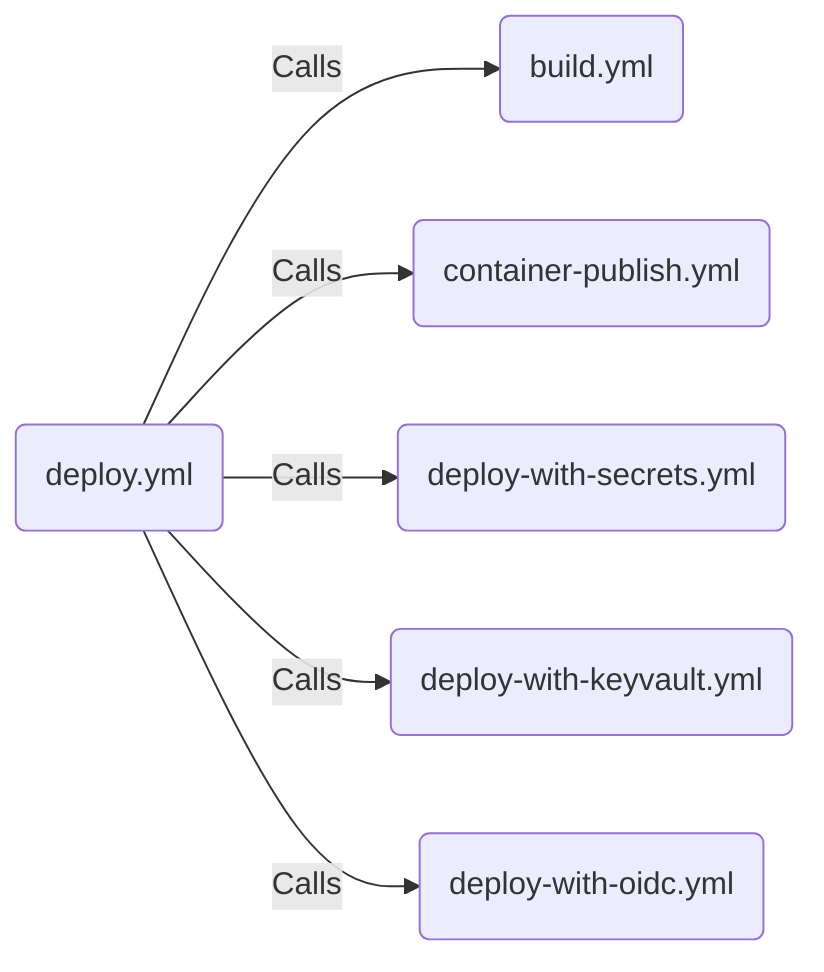

# Deployer

A simple Node.js app showing different ways to use secrets in Actions:

- GitHub Secrets in Repo and Environments.
- Using OIDC to avoid storing secrets at all.
- Getting Secrets from Azure Key Vault.

## Workflows

The deploy.yml workflow is the orchestrator, calling the other reusable workflows.:

(This is an embedded [Markdown defined Mermaid diagram](https://github.blog/2022-02-14-include-diagrams-markdown-files-mermaid/))

